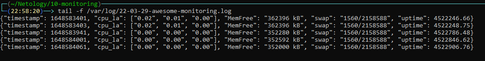

# Домашняя работа к занятию "10.01. Зачем и что нужно мониторить"

## Обязательные задания

1. Вас пригласили настроить мониторинг на проект. На онбординге вам рассказали, что проект представляет из себя 
платформу для вычислений с выдачей текстовых отчетов, которые сохраняются на диск. Взаимодействие с платформой 
осуществляется по протоколу http. Также вам отметили, что вычисления загружают ЦПУ. Какой минимальный набор метрик вы
выведите в мониторинг и почему?
```
  1. RAM - Бесперебойная работоспособность системы завис от данной метрики, поэтому необходимо всегда мониторить утилизацию и своевременно принимать меры по увеличению выделенных ресурсов или оптимизацию системы;
  2. CPU LA - Данная метрика необходимо мониторить, поскольку система требовательна к данному ресурсу;
  3. Доступность WEB ресурса - Необходимо мониторить коды ответов на запросы, для своевременного выявления проблем с доступностью ресурса;
  4. Файловая система - По описанию системы, мониторинг утилизации дискового пространства очень важен, во избежания аварии связанных с отсутствием возможности сохранения отчетов;
  5. IOPS - Поскольку системе сохраняет отчет на диск, необходимо отслеживать данную метрику;
```
2. Менеджер продукта посмотрев на ваши метрики сказал, что ему непонятно что такое RAM/inodes/CPUla. Также он сказал, 
что хочет понимать, насколько мы выполняем свои обязанности перед клиентами и какое качество обслуживания. Что вы 
можете ему предложить?
``` 
  Необходимо использовать SLA, SLO, SLI для формирования общего представления о работоспособности системы. Данные соглашения описывают как часто будет доступна система, как быстро ответственная команда отреагирует на возникшие проблемы, как быстро проблемы будет устранена.

  SLA — это договор, который обещает обеспечить определенный уровень доступности, надежности или производительности службы.
  SLO — это конкретная цель, определенная в договоре.
  SLI — измеряет степень, в которой команды соблюдают обещания SLO, которые они дают в контрактах SLA.
```
3. Вашей DevOps команде в этом году не выделили финансирование на построение системы сбора логов. Разработчики в свою 
очередь хотят видеть все ошибки, которые выдают их приложения. Какое решение вы можете предпринять в этой ситуации, 
чтобы разработчики получали ошибки приложения?
```
Можно использовать методологию, разработанную в Яндексе "Логи не нужны?" и наиболее критичные логи преобразовывать в метрики и передавать их в систему мониторинга и использовать  в дальнейшем для разбора инцидентов;
```
3. Вы, как опытный SRE, сделали мониторинг, куда вывели отображения выполнения SLA=99% по http кодам ответов. 
Вычисляете этот параметр по следующей формуле: summ_2xx_requests/summ_all_requests. Данный параметр не поднимается выше 
70%, но при этом в вашей системе нет кодов ответа 5xx и 4xx. Где у вас ошибка?

```
Помимо ответов 2хх, в SLI необходимо еще учитывать ответы 3хх (перенаправление), поэтому SLI необходимо рассчитывать по формуле:
SLI = (summ_2xx_requests + summ_3xx_requests)/summ_all_requests
```

## Дополнительное задание (со звездочкой*) - необязательно к выполнению

Вы устроились на работу в стартап. На данный момент у вас нет возможности развернуть полноценную систему 
мониторинга, и вы решили самостоятельно написать простой python3-скрипт для сбора основных метрик сервера. Вы, как 
опытный системный-администратор, знаете, что системная информация сервера лежит в директории `/proc`. 
Также, вы знаете, что в системе Linux есть  планировщик задач cron, который может запускать задачи по расписанию.

Суммировав все, вы спроектировали приложение, которое:
- является python3 скриптом
- собирает метрики из папки `/proc`
- складывает метрики в файл 'YY-MM-DD-awesome-monitoring.log' в директорию /var/log 
(YY - год, MM - месяц, DD - день)
- каждый сбор метрик складывается в виде json-строки, в виде:
  + timestamp (временная метка, int, unixtimestamp)
  + metric_1 (метрика 1)
  + metric_2 (метрика 2)
  
     ...
     
  + metric_N (метрика N)
  
- сбор метрик происходит каждую 1 минуту по cron-расписанию

Для успешного выполнения задания нужно привести:

а) работающий код python3-скрипта,

б) конфигурацию cron-расписания,

в) пример верно сформированного 'YY-MM-DD-awesome-monitoring.log', имеющий не менее 5 записей,

P.S.: количество собираемых метрик должно быть не менее 4-х.
P.P.S.: по желанию можно себя не ограничивать только сбором метрик из `/proc`.

```python
import json
import time
from datetime import date


def cpu_info():
    with open('/proc/loadavg', 'r') as f:
        cpu_la = f.readline().split(" ")[:3]
    return cpu_la


def mem_info():
    meminfo = {}
    with open('/proc/meminfo', 'r') as f:
        for line in f:
            meminfo[line.split(':')[0]] = line.split(':')[1].strip()
    return meminfo['MemFree']


def swap_info():
    with open('/proc/swaps', 'r') as f:
        for line1, line2 in zip(f, f):
            swap = line2.split()
    return (f'{swap[3]}/{swap[2]}')


def uptime_info():
    with open('/proc/uptime', 'r') as f:
        uptime_seconds = float(f.readline().split()[0])
    return uptime_seconds


def create_log():
    log = dict(
            timestamp = int(time.time()),
            cpu_la = cpu_info(),
            MemFree = mem_info(),
            swap = swap_info(),
            uptime = uptime_info()
            )
    filename = date.today().strftime('%y-%m-%d-awesome-monitoring.log')
    with open(f'/var/log/{filename}', 'a') as f:
        f.write(f'{json.dumps(log)}\n')


if __name__ == "__main__":
    create_log()

```
```bash
* * * * * /usr/bin/python3 /home/emil/Netology/10-monitoring/get_proc.py
```



---
