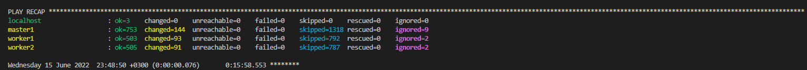

# Домашнее задание к занятию "12.5 Сетевые решения CNI"
После работы с Flannel появилась необходимость обеспечить безопасность для приложения. Для этого лучше всего подойдет Calico.
## Задание 1: установить в кластер CNI плагин Calico
Для проверки других сетевых решений стоит поставить отличный от Flannel плагин — например, Calico. Требования: 
* установка производится через ansible/kubespray;


* после применения следует настроить политику доступа к hello-world извне. Инструкции [kubernetes.io](https://kubernetes.io/docs/concepts/services-networking/network-policies/), [Calico](https://docs.projectcalico.org/about/about-network-policy)

1. Запуск [Deployment](hello-world.yaml)

    `kubectl apply -f hello-world.yaml`

1. Создаем Service для публикации сервиса наружу

    `kubectl expose deployment hello-world --type=LoadBalancer --port=8080 -n app-namespace`

1. Проверяем порты
    ```bash
    ──> kubectl get service -n app-namespace
    NAME          TYPE           CLUSTER-IP     EXTERNAL-IP   PORT(S)          AGE
    hello-world   LoadBalancer   10.233.52.58   <pending>     8080:31777/TCP   19s
    ```
1. Проверяем доступ из сети Интернет

    

1. Включаем [Network Policy](networkpolicy.yaml)
    ```bash
    ──> kubectl apply -f networkpolicy.yaml                                         
    networkpolicy.networking.k8s.io/hello-world-policy created

    ──> kubectl get networkpolicies -n app-namespace
    NAME                 POD-SELECTOR      AGE
    hello-world-policy   app=hello-world   59s
    ```

1. Проверяем доступ из сети Интернет после включения сетевой политики

    


## Задание 2: изучить, что запущено по умолчанию
Самый простой способ — проверить командой calicoctl get <type>. Для проверки стоит получить список нод, ipPool и profile.
Требования: 
* установить утилиту calicoctl;
* получить 3 вышеописанных типа в консоли.

```bash
emil@master1:~$ calicoctl get node
NAME      
master1   
worker1   
worker2   

emil@master1:~$ calicoctl get ippool
NAME           CIDR             SELECTOR   
default-pool   10.233.64.0/18   all()      

emil@master1:~$ calicoctl get profile
NAME                                                 
projectcalico-default-allow                          
kns.app-namespace                                    
kns.default                                          
kns.kube-node-lease                                  
kns.kube-public                                      
kns.kube-system                                      
ksa.app-namespace.default                            
ksa.default.default                                  
ksa.kube-node-lease.default                          
ksa.kube-public.default                              
ksa.kube-system.attachdetach-controller              
ksa.kube-system.bootstrap-signer                     
ksa.kube-system.calico-kube-controllers              
ksa.kube-system.calico-node                          
ksa.kube-system.certificate-controller               
ksa.kube-system.clusterrole-aggregation-controller   
ksa.kube-system.coredns                              
ksa.kube-system.cronjob-controller                   
ksa.kube-system.daemon-set-controller                
ksa.kube-system.default                              
ksa.kube-system.deployment-controller                
ksa.kube-system.disruption-controller                
ksa.kube-system.dns-autoscaler                       
ksa.kube-system.endpoint-controller                  
ksa.kube-system.endpointslice-controller             
ksa.kube-system.endpointslicemirroring-controller    
ksa.kube-system.ephemeral-volume-controller          
ksa.kube-system.expand-controller                    
ksa.kube-system.generic-garbage-collector            
ksa.kube-system.horizontal-pod-autoscaler            
ksa.kube-system.job-controller                       
ksa.kube-system.kube-proxy                           
ksa.kube-system.namespace-controller                 
ksa.kube-system.node-controller                      
ksa.kube-system.nodelocaldns                         
ksa.kube-system.persistent-volume-binder             
ksa.kube-system.pod-garbage-collector                
ksa.kube-system.pv-protection-controller             
ksa.kube-system.pvc-protection-controller            
ksa.kube-system.replicaset-controller                
ksa.kube-system.replication-controller               
ksa.kube-system.resourcequota-controller             
ksa.kube-system.root-ca-cert-publisher               
ksa.kube-system.service-account-controller           
ksa.kube-system.service-controller                   
ksa.kube-system.statefulset-controller               
ksa.kube-system.token-cleaner                        
ksa.kube-system.ttl-after-finished-controller        
ksa.kube-system.ttl-controller             

```


### Как оформить ДЗ?

Выполненное домашнее задание пришлите ссылкой на .md-файл в вашем репозитории.
