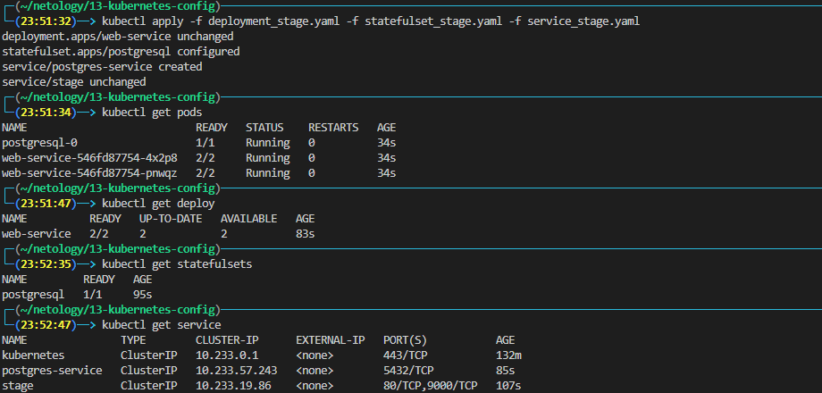
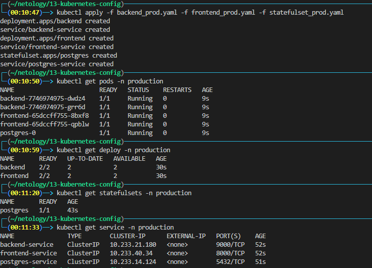

# Домашнее задание к занятию "13.1 контейнеры, поды, deployment, statefulset, services, endpoints"
Настроив кластер, подготовьте приложение к запуску в нём. Приложение стандартное: бекенд, фронтенд, база данных. Его можно найти в папке 13-kubernetes-config.

## Задание 1: подготовить тестовый конфиг для запуска приложения
Для начала следует подготовить запуск приложения в stage окружении с простыми настройками. Требования:
* под содержит в себе 2 контейнера — фронтенд, бекенд;
* регулируется с помощью deployment фронтенд и бекенд;
* база данных — через statefulset.

1. Пушим проект в свой dockerhub
    ```bash
    docker-compose build
    docker login
    docker tag 13-kubernetes-config_backend:latest emiltk/kubernetes-config_backend:latest 
    docker tag 13-kubernetes-config_frontend:latest emiltk/kubernetes-config_frontend:latest
    docker push emiltk/kubernetes-config_backend:latest
    docker push emiltk/kubernetes-config_frontend:latest 
    ```
1. Создаем манифесты:
    * [Deployment](./deployment_stage.yaml)
    * [StatefulSet](./statefulset_stage.yaml)
    * [Services](./service_stage.yaml)

1. Запускаем
    ```bash
    kubectl apply -f deployment_stage.yaml -f statefulset_stage.yaml -f service_stage.yaml
    ```

1. Проверяем

    


## Задание 2: подготовить конфиг для production окружения
Следующим шагом будет запуск приложения в production окружении. Требования сложнее:
* каждый компонент (база, бекенд, фронтенд) запускаются в своем поде, регулируются отдельными deployment’ами;
* для связи используются service (у каждого компонента свой);
* в окружении фронта прописан адрес сервиса бекенда;
* в окружении бекенда прописан адрес сервиса базы данных.

1. создаем `namespace` production
    ```bash
    kubectl create namespase production
    ```
1. Создаем манифесты:
    * [Backend](./backend_prod.yaml)
    * [Frontend](./frontend_prod.yaml)
    * [StatefulSet](statefulset_prod.yaml)

1. Запускаем:
    ```bash
    kubectl apply -f backend_prod.yaml -f frontend.yaml -f statefulset_prod.yaml
    ```

4. Проверяем:

    

    ```bash
    kubectl port-forward -n production services/frontend-service 8000:8000
    ```
    
