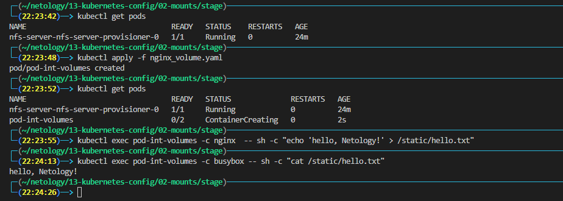
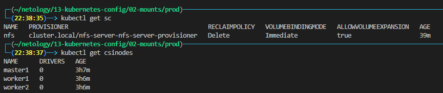
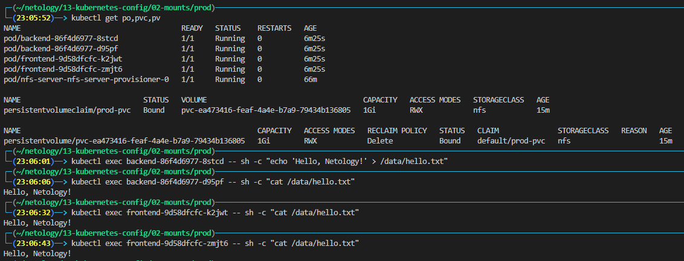
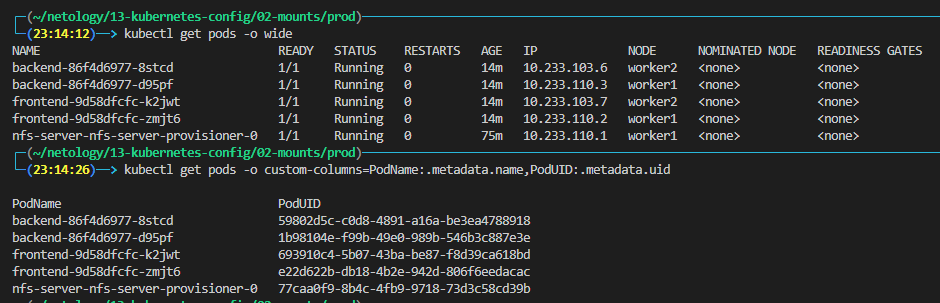
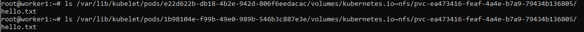
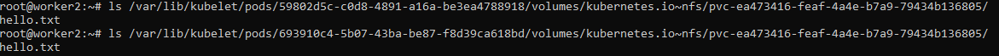

# Домашнее задание к занятию "13.2 разделы и монтирование"
Приложение запущено и работает, но время от времени появляется необходимость передавать между бекендами данные. А сам бекенд генерирует статику для фронта. Нужно оптимизировать это.
Для настройки NFS сервера можно воспользоваться следующей инструкцией (производить под пользователем на сервере, у которого есть доступ до kubectl):
* установить helm: curl https://raw.githubusercontent.com/helm/helm/master/scripts/get-helm-3 | bash
* добавить репозиторий чартов: helm repo add stable https://charts.helm.sh/stable && helm repo update
* установить nfs-server через helm: helm install nfs-server stable/nfs-server-provisioner

В конце установки будет выдан пример создания PVC для этого сервера.

## Задание 1: подключить для тестового конфига общую папку
В stage окружении часто возникает необходимость отдавать статику бекенда сразу фронтом. Проще всего сделать это через общую папку. Требования:
* в поде подключена общая папка между контейнерами (например, /static);
* после записи чего-либо в контейнере с беком файлы можно получить из контейнера с фронтом.



## Задание 2: подключить общую папку для прода
Поработав на stage, доработки нужно отправить на прод. В продуктиве у нас контейнеры крутятся в разных подах, поэтому потребуется PV и связь через PVC. Сам PV должен быть связан с NFS сервером. Требования:
* все бекенды подключаются к одному PV в режиме ReadWriteMany;
* фронтенды тоже подключаются к этому же PV с таким же режимом;
* файлы, созданные бекендом, должны быть доступны фронту.

- - -
1. Устанавливаем `nfs-common` на все worker node.

    ```bash
    ssh emil@worker1 'sudo apt install nfs-common -y'    
    ssh emil@worker2'sudo apt install nfs-common -y'    
    ```

1. Проверяем наличие установленного `nfs-server-provisioner`

    

1. Подготавливаем манифесты
    * [pvc.yaml](./manifests/prod/pvc.yaml)
    * [frontend.yaml](./manifests/prod/frontend.yaml)
    * [backend.yaml](./manifests/prod/backend.yaml)

1. Запускаем
    ```bash
    kubectl apply -f pvc.yaml -f frontend.yaml -f backend.yaml
    ```

1. Проверяем доступность со всех подов
 
    

1. Проверяем файлы непосредственно на нодах
    
    
    
    

---
