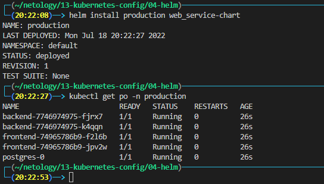
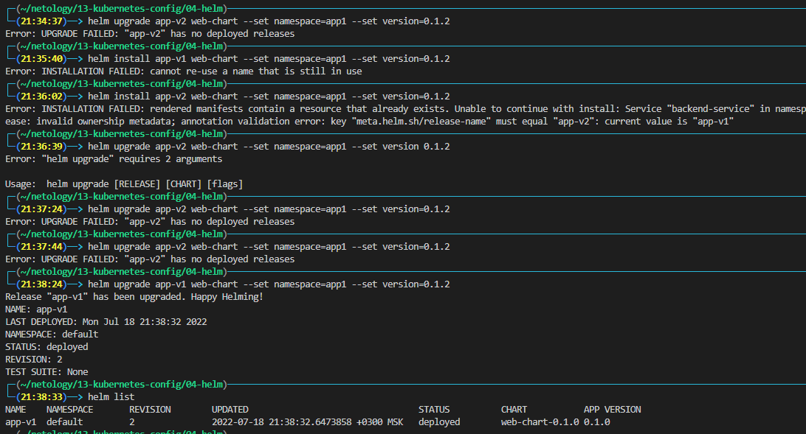
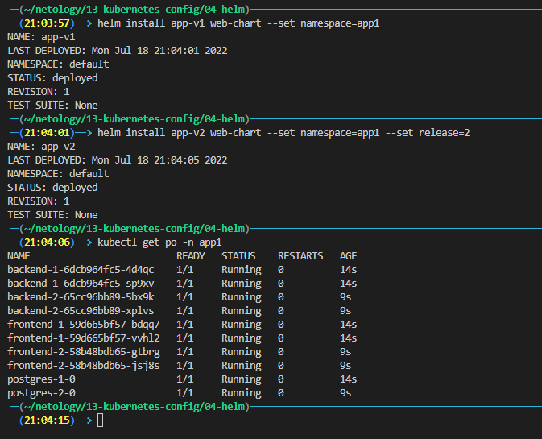
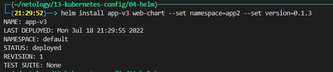

# Домашнее задание к занятию "13.4 инструменты для упрощения написания конфигурационных файлов. Helm и Jsonnet"
В работе часто приходится применять системы автоматической генерации конфигураций. Для изучения нюансов использования разных инструментов нужно попробовать упаковать приложение каждым из них.

## Задание 1: подготовить helm чарт для приложения
Необходимо упаковать приложение в чарт для деплоя в разные окружения. Требования:
* каждый компонент приложения деплоится отдельным deployment’ом/statefulset’ом;
* в переменных чарта измените образ приложения для изменения версии.

- - - 
### templates
[backend.yaml](./web-chart/templates/backend.yaml)
[frontend.yaml](./web-chart/templates/frontend.yaml)
[statefulset.yaml](./web-chart/templates/statefulset.yaml)

### Values
[values.yaml](./web-chart/values.yaml)

### Chart
[Chart.yaml](./web-chart/Chart.yaml)
 

- - -

## Задание 2: запустить 2 версии в разных неймспейсах
Подготовив чарт, необходимо его проверить. Попробуйте запустить несколько копий приложения:
* одну версию в namespace=app1;
* вторую версию в том же неймспейсе;
* третью версию в namespace=app2.

- - -
К сожалению, у меня никак не получилось поднять вторую версию в том же неймспейсе используя `--set version`.

Пробовал добавлять к имени сервиса `{{ .Version }}` но версия не менялась.

Решил сделать по-другому, к имени каждого сервиса добавил переменную `release` для избежания дублей в именах подов, не знаю насколько это правильное решение.

---

