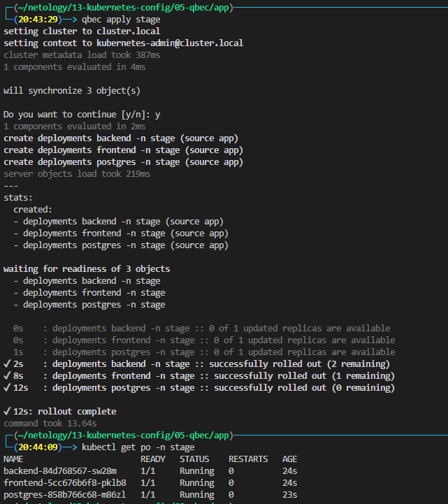
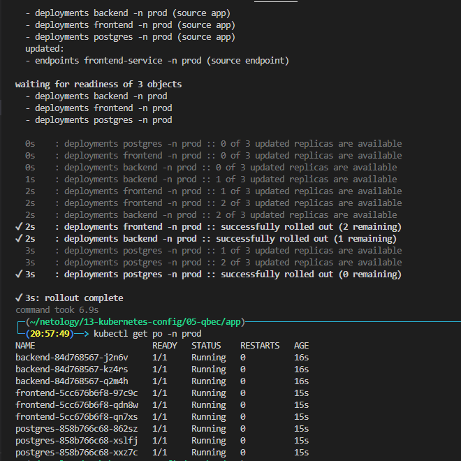

# Домашнее задание к занятию "13.5 поддержка нескольких окружений на примере Qbec"
Приложение обычно существует в нескольких окружениях. Для удобства работы следует использовать соответствующие инструменты, например, Qbec.

## Задание 1: подготовить приложение для работы через qbec
Приложение следует упаковать в qbec. Окружения должно быть 2: stage и production. 

Требования:
* stage окружение должно поднимать каждый компонент приложения в одном экземпляре;
* production окружение — каждый компонент в трёх экземплярах;
* для production окружения нужно добавить endpoint на внешний адрес.

- - -
* Установка [jsonnet](https://github.com/google/jsonnet/releases) разархивировать в /usr/local/bin
* Установка [qbec](https://github.com/splunk/qbec/releases) разархивировать в /usr/local/bin

* [app.jsonnet](./app/components/app.jsonnet)
* [service.jsonnet](./app/components/services.jsonnet)
* [params.libsonnet](./app/params.libsonnet)
* [qbec.yaml](./app/qbec.yaml) 

### Запуск stage
```
kubectl create ns stage
qbec apply stage
```


### Запуск production
```
kubectl create ns prod
qbec apply prod
```
