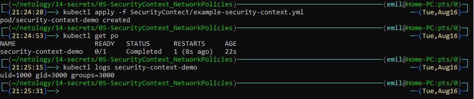

# Домашняя работа к занятию "14.5 SecurityContext, NetworkPolicies"

## Задача 1: Рассмотрите пример 14.5/example-security-context.yml

Создайте модуль

```
kubectl apply -f 14.5/example-security-context.yml
```

Проверьте установленные настройки внутри контейнера



```
kubectl logs security-context-demo
uid=1000 gid=3000 groups=3000
```

## Задача 2 (*): Рассмотрите пример 14.5/example-network-policy.yml

Создайте два модуля. Для первого модуля разрешите доступ к внешнему миру
и ко второму контейнеру. Для второго модуля разрешите связь только с
первым контейнером. Проверьте корректность настроек.

1. Запускаем поды:
    * [app1.yml](./NetworkPolicies/app1.yml)
    * [app2.yml](./NetworkPolicies/app2.yml)

    

2. Проверяем доступ к сети Интернет и между подами:

    

3. Применяем политики на блокировку всего входящего и исходящего трафика и проверяем доступ к сети Интернет и между подами:

    * [00-deny-egress-all.yml](./NetworkPolicies/Policies/Egress/00-deny-egress-all.yml)
    * [00-deny-ingress-all.yml](./NetworkPolicies/Policies/Ingress/00-deny-ingress-all.yml)

    

    

4. Открываем доступ для пода `app1` в сеть Интернет и проверяем:

    * [01-allow-inet-app1.yml](./NetworkPolicies/Policies/Egress/01-allow-inet-app1.yml)

    

5. Открываем доступ поду `app1` до пода `app2`, на поде `app2` разрешаем входящий трафик от `app1`:

    * [02-allow-icmp-app1.yml](./NetworkPolicies/Policies/Egress/02-allow-icmp-app1.yml)
    * [01-allow-icmp-app2.yml](./NetworkPolicies/Policies/Ingress/01-allow-icmp-app2.yml)

    

6. Открываем доступ поду `app2` до пода `app1`, на поде `app1` разрешаем входящий трафик от `app2`:

    * [03-allow-icmp-app2.yml](./NetworkPolicies/Policies/Egress/03-allow-icmp-app2.yml)
    * [02-allow-icmp-app1.yml](./NetworkPolicies/Policies/Ingress/02-allow-icmp-app1.yml)

    
