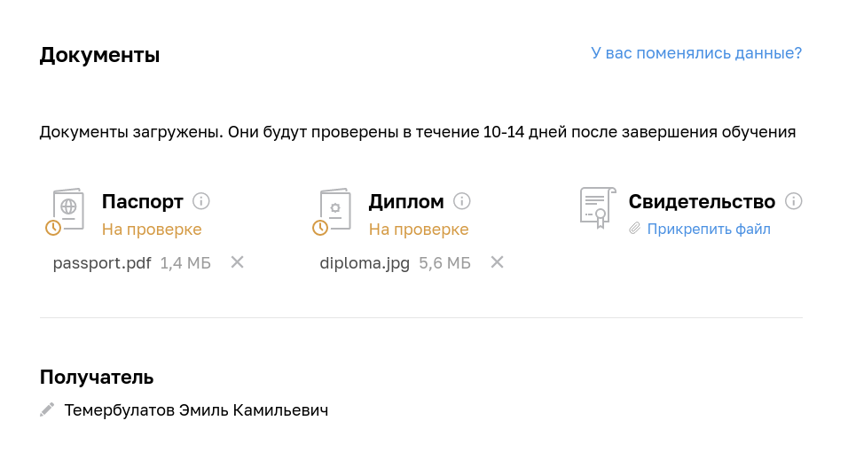

1. Получилось ли у вас загрузить документы подтверждающие вашу личность и диплом о высшем или среднем специальном образовании в личный кабинет?

* Да 

Студентов, у которых нет диплома о высшем и среднем специальном образовании, прошу ответить дополнительно на следующие вопросы:

2. Нужна ли вам справка об обучении после сдачи диплома? (если да, просьба написать техническому координатору Роману Алексееву после получения зачёта по дипломной работе)

* Нет

Для допуска к выполнению дипломной работы необходимо успешно завершить все модули входящие в профессию. Необходимо выполнить минимум 80% ДЗ на каждом модуле.

3. Удалось ли вам сдать минимум 80% ДЗ на каждом модуле профессии?

* Да
