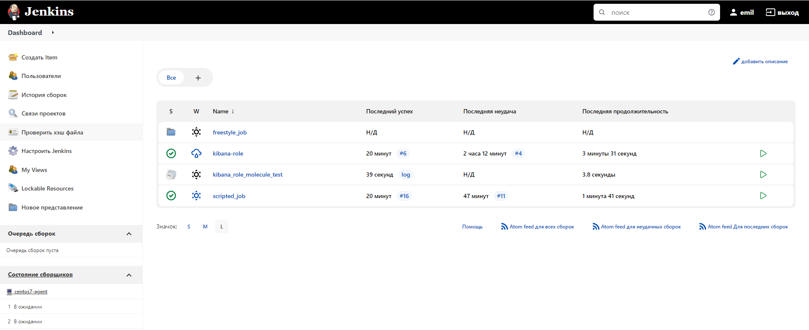
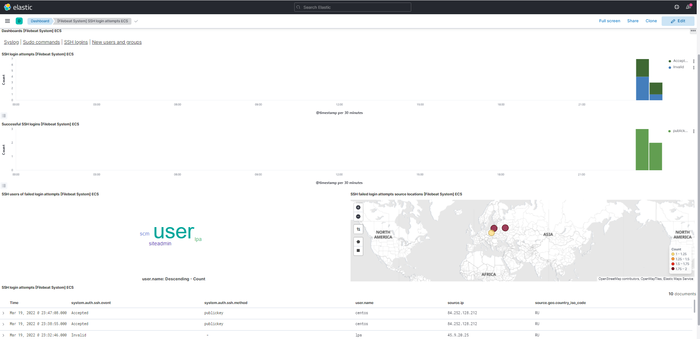

# Домашняя работа к занятию "09.04 Jenkins"

## Подготовка к выполнению

1. Создать 2 VM: для jenkins-master и jenkins-agent.
2. Установить jenkins при помощи playbook'a.
3. Запустить и проверить работоспособность.
4. Сделать первоначальную настройку.

## Основная часть

1. Сделать Freestyle Job, который будет запускать `molecule test` из любого вашего репозитория с ролью.
    * Для тестирования моей роли [Kibana-role](https://github.com/EmilTK/kibana-role) необходим инстанс с `Elasticsearch` для этих целей мною были внесены изменения в файл [molecule.yml](https://github.com/EmilTK/kibana-role/blob/master/molecule/default/molecule.yml), где вместо хардкода IP, указал чтение из переменной окружения, которая в свою очередь создается через `jenkins`; 
2. Сделать Declarative Pipeline Job, который будет запускать `molecule test` из любого вашего репозитория с ролью.
    ```java
        pipeline {
        agent {
            label 'docker'
        }
        stages {
            stage('checkout git'){
                steps{
                    git credentialsId: '74092a9d-e0e2-46a5-a9f7-bde0932ee998', url: 'git@github.com:EmilTK/kibana-role.git'
                }
            }
            stage('install dependencies'){
                steps {
                    sh 'pip3 install -r test-requirements.txt'
                }
            }
            stage('run molecule'){
                steps {
                    sh 'molecule test'    
                }
                
            }
        }
    }
    ```
3. Перенести Declarative Pipeline в репозиторий в файл `Jenkinsfile`.
    * [Jenkinsfile](https://github.com/EmilTK/kibana-role/blob/master/Jenkinsfile)
4. Создать Multibranch Pipeline на запуск `Jenkinsfile` из репозитория.
    
5. Создать Scripted Pipeline, наполнить его скриптом из [pipeline](./pipeline).
    * По коментарию Алексея, данный пункт указан по ошибке и выполнять не нужно;
6. Внести необходимые изменения, чтобы Pipeline запускал `ansible-playbook` без флагов `--check --diff`, если не установлен параметр при запуске джобы (prod_run = True), по умолчанию параметр имеет значение False и запускает прогон с флагами `--check --diff`.
    * Для запуска с загруженным приватным ключем использовал плагин `Ansible`;
    * Для загрузки зависимых ролей, пришлось изменить файл [requirements.yml](https://github.com/EmilTK/ansible_netology/blob/08-04/requirements.yml), на использование `https` ссылок, вместо `ssh`, поскольку не смог подставить приватный ключ команде `ansible-galaxy install -r requirements.yml` 
    * Для проверки значения переменной 'prod_run' необходимо использовать конструкцию:
    ```java
    if (params.prod_run){
        stage('Run ansible-playbook'){
            ...
        }
    } else {
        stage('Run ansible-playbook-check'){
            ...
        }  
    }
    ```
7. Проверить работоспособность, исправить ошибки, исправленный Pipeline вложить в репозиторий в файл `ScriptedJenkinsfile`. Цель: получить собранный стек ELK в Ya.Cloud.


8. Отправить две ссылки на репозитории в ответе: с ролью и Declarative Pipeline и c плейбукой и Scripted Pipeline.
    * Declarative Pipeline - [Kibana-role](https://github.com/EmilTK/kibana-role)
    * Scripted Pipeline - [ansible_netology](https://github.com/EmilTK/ansible_netology/tree/08-04)


## Необязательная часть

1. Создать скрипт на groovy, который будет собирать все Job, которые завершились хотя бы раз неуспешно. Добавить скрипт в репозиторий с решеним с названием `AllJobFailure.groovy`.
2. Дополнить Scripted Pipeline таким образом, чтобы он мог сначала запустить через Ya.Cloud CLI необходимое количество инстансов, прописать их в инвентори плейбука и после этого запускать плейбук. Тем самым, мы должны по нажатию кнопки получить готовую к использованию систему.

---
