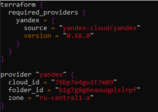

# Домашняя работа к занятию "7.2. Облачные провайдеры и синтаксис Terraform."

## Задача 1 (вариант с AWS). Регистрация в aws и знакомство с основами (необязательно, но крайне желательно).

AWS предоставляет достаточно много бесплатных ресурсов в первых год после регистрации, подробно описано [здесь](https://aws.amazon.com/free/).
1. Создайте аккаут aws.
1. Установите c aws-cli https://aws.amazon.com/cli/.
1. Выполните первичную настройку aws-sli https://docs.aws.amazon.com/cli/latest/userguide/cli-configure-quickstart.html.
1. Создайте IAM политику для терраформа c правами
    * AmazonEC2FullAccess
    * AmazonS3FullAccess
    * AmazonDynamoDBFullAccess
    * AmazonRDSFullAccess
    * CloudWatchFullAccess
    * IAMFullAccess
1. Добавьте переменные окружения
    ```
    export AWS_ACCESS_KEY_ID=(your access key id)
    export AWS_SECRET_ACCESS_KEY=(your secret access key)
    ```
1. Создайте, остановите и удалите ec2 инстанс (любой с пометкой `free tier`) через веб интерфейс.

В виде результата задания приложите вывод команды `aws configure list`.


## Задача 1 (Вариант с Yandex.Cloud). Регистрация в aws и знакомство с основами (необязательно, но крайне желательно).

1. Подробная инструкция на русском языке содержится [здесь](https://cloud.yandex.ru/docs/solutions/infrastructure-management/terraform-quickstart).
2. Обратите внимание на период бесплатного использования после регистрации аккаунта.
3. Используйте раздел "Подготовьте облако к работе" для регистрации аккаунта. Далее раздел "Настройте провайдер" для подготовки
базового терраформ конфига.
4. Воспользуйтесь [инструкцией](https://registry.terraform.io/providers/yandex-cloud/yandex/latest/docs) на сайте терраформа, что бы
не указывать авторизационный токен в коде, а терраформ провайдер брал его из переменных окружений.

* Не совсем понятно, что необходимо приложить в результате выполнения задания.




## Задача 2. Созданием aws ec2 или yandex_compute_instance через терраформ.

1. В каталоге `terraform` вашего основного репозитория, который был создан в начале курсе, создайте файл `main.tf` и `versions.tf`.
2. Зарегистрируйте провайдер
   1. для [aws](https://registry.terraform.io/providers/hashicorp/aws/latest/docs). В файл `main.tf` добавьте
   блок `provider`, а в `versions.tf` блок `terraform` с вложенным блоком `required_providers`. Укажите любой выбранный вами регион
   внутри блока `provider`.
   2. либо для [yandex.cloud](https://registry.terraform.io/providers/yandex-cloud/yandex/latest/docs). Подробную инструкцию можно найти
   [здесь](https://cloud.yandex.ru/docs/solutions/infrastructure-management/terraform-quickstart).
3. Внимание! В гит репозиторий нельзя пушить ваши личные ключи доступа к аккаунту. Поэтому в предыдущем задании мы указывали
их в виде переменных окружения.
4. В файле `main.tf` воспользуйтесь блоком `data "aws_ami` для поиска ami образа последнего Ubuntu.  
5. В файле `main.tf` создайте рессурс
   1. либо [ec2 instance](https://registry.terraform.io/providers/hashicorp/aws/latest/docs/resources/instance).
   Постарайтесь указать как можно больше параметров для его определения. Минимальный набор параметров указан в первом блоке
   `Example Usage`, но желательно, указать большее количество параметров.
   2. либо [yandex_compute_image](https://registry.terraform.io/providers/yandex-cloud/yandex/latest/docs/resources/compute_image).
6. Также в случае использования aws:
   1. Добавьте data-блоки `aws_caller_identity` и `aws_region`.
   2. В файл `outputs.tf` поместить блоки `output` с данными об используемых в данный момент:
       * AWS account ID,
       * AWS user ID,
       * AWS регион, который используется в данный момент,
       * Приватный IP ec2 инстансы,
       * Идентификатор подсети в которой создан инстанс.  
7. Если вы выполнили первый пункт, то добейтесь того, что бы команда `terraform plan` выполнялась без ошибок.

```bash
┌─(/mnt/d/devops-netology/terraform)────────────────────────────────────────────────────────────────(emil@huanan:1)─┐
└─(16:59:37 on main ✹ ✭)──> terraform apply -auto-approve                                            ──(Sat,Dec18)─┘

Plan: 1 to add, 0 to change, 0 to destroy.

Changes to Outputs:
  + account_id       = "665707916523"
  + caller_user      = "AIDAZV72IVTVR3NP5NT3F"
  + instance_ip_addr = (known after apply)
  + instance_subnet  = (known after apply)
  + region_name      = "eu-central-1"
aws_instance.netology: Creating...
aws_instance.netology: Still creating... [10s elapsed]
aws_instance.netology: Creation complete after 14s [id=i-020e393990e58e30b]

Apply complete! Resources: 1 added, 0 changed, 0 destroyed.

Outputs:

account_id = "665707916523"
caller_user = "AIDAZV72IVTVR3NP5NT3F"
instance_ip_addr = "172.31.5.62"
instance_subnet = "subnet-06a801c622d6a4351"
region_name = "eu-central-1"
```


В качестве результата задания предоставьте:
1. Ответ на вопрос: при помощи какого инструмента (из разобранных на прошлом занятии) можно создать свой образ ami?
  * Packer
1. Ссылку на репозиторий с исходной конфигурацией терраформа.  
  * [Terraform](../../terraform)

---
