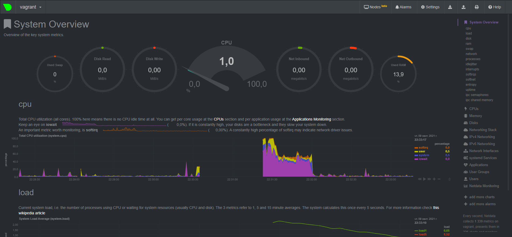

# Домашняя работа к занятию "3.4. Операционные системы, лекция 2"

1. На лекции мы познакомились с [node_exporter](https://github.com/prometheus/node_exporter/releases). В демонстрации его исполняемый файл запускался в background. Этого достаточно для демо, но не для настоящей production-системы, где процессы должны находиться под внешним управлением. Используя знания из лекции по systemd, создайте самостоятельно простой [unit-файл](https://www.freedesktop.org/software/systemd/man/systemd.service.html) для node_exporter:

    * поместите его в автозагрузку,
    * предусмотрите возможность добавления опций к запускаемому процессу через внешний файл (посмотрите, например, на `systemctl cat cron`),
    * удостоверьтесь, что с помощью systemctl процесс корректно стартует, завершается, а после перезагрузки автоматически поднимается.
   
    * #### Установка node_exporter ####
      `wget https://github.com/prometheus/node_exporter/releases/download/v1.2.2/node_exporter-1.2.2.linux-amd64.tar.gz` </br>
      `tar xvfz node_exporter-1.2.2.linux-amd64.tar.gz -C /tmp`</br>
      `cp /tmp/node_exporter-1.2.2.linux-amd64/node_exporter /usr/local/bin` </br>
    * #### Создание unit-файла ####  
      ```bash
      root@vagrant:~# vim /etc/systemd/system/node_exporter.service
     
      [Unit]
      Description=Node Exporter
      After=network.target

      [Service]
      Type=simple
      Restart=always
      EnvironmentFile=/etc/default/node_exporter
      ExecStart=/usr/local/bin/node_exporter

      [Install]
      WantedBy=multi-user.target    
      ```
    * #### Инициализация unit-файлов ####  
      `systemctl daemon-reload`
   * #### Добавление в автозагрузку ####
      `systemctl enable node_exporter.service`
   * #### Запуск процесса ####
      `systemctl start node_exporter.service`
   * #### Просмотр лога процесса ####
      ```bash
      root@vagrant:~# systemctl status node_exporter.service
      ● node_exporter.service - Node Exporter
     Loaded: loaded (/etc/systemd/system/node_exporter.service; enabled; vendor preset: enabled)
     Active: active (running) since Thu 2021-09-09 17:44:49 UTC; 30min ago
     Main PID: 1267 (node_exporter)
       Tasks: 4 (limit: 1071)
     Memory: 2.1M
     CGroup: /system.slice/node_exporter.service
             └─1267 /usr/local/bin/node_exporter
      ```  
   * #### Проверка автозагрузки процесса ####
      ```bash
      root@vagrant:~# journalctl -u node_exporter.service --since today
      -- Logs begin at Thu 2021-09-02 19:53:40 MSK, end at Sat 2021-09-11 15:31:50 MSK. --
      Sep 11 15:28:51 vagrant systemd[1]: Started Node Exporter.
      ```
1. Ознакомьтесь с опциями node_exporter и выводом `/metrics` по-умолчанию. Приведите несколько опций, которые вы бы выбрали для базового мониторинга хоста по CPU, памяти, диску и сети.
   * `node_cpu_seconds_total{cpu="*",mode="user"}`
   * `node_cpu_seconds_total{cpu="*",mode="system"}`
   * `node_cpu_seconds_total{cpu="*",mode="idle"}`
   * `node_cpu_seconds_total{cpu="*",mode="iowait"}`
   * `node_memory_MemFree_bytes`
   * `node_memory_MemTotal_bytes`
   * `node_filesystem_avail_bytes`
   * `node_filesystem_size_bytes` 
   * `node_network_receive_bytes_total`
   * `node_network_transmit_bytes_total`
   
1. Установите в свою виртуальную машину [Netdata](https://github.com/netdata/netdata). Воспользуйтесь [готовыми пакетами](https://packagecloud.io/netdata/netdata/install) для установки (`sudo apt install -y netdata`). После успешной установки:
    * в конфигурационном файле `/etc/netdata/netdata.conf` в секции [web] замените значение с localhost на `bind to = 0.0.0.0`,
    * добавьте в Vagrantfile проброс порта Netdata на свой локальный компьютер и сделайте `vagrant reload`:

    ```bash
    config.vm.network "forwarded_port", guest: 19999, host: 19999
    ```

    После успешной перезагрузки в браузере *на своем ПК* (не в виртуальной машине) вы должны суметь зайти на `localhost:19999`. Ознакомьтесь с метриками, которые по умолчанию собираются Netdata и с комментариями, которые даны к этим метрикам.

   * Установил, ознакомился с метриками
   
   

1. Можно ли по выводу `dmesg` понять, осознает ли ОС, что загружена не на настоящем оборудовании, а на системе виртуализации?
   * Можно:
   ```bash
   vagrant@vagrant:~$ dmesg | grep -i virtual
   [    0.000000] DMI: innotek GmbH VirtualBox/VirtualBox, BIOS VirtualBox 12/01/2006
   [    0.003743] CPU MTRRs all blank - virtualized system.
   [    0.112644] Booting paravirtualized kernel on KVM
   [    5.493237] systemd[1]: Detected virtualization oracle.
   ```
1. Как настроен sysctl `fs.nr_open` на системе по-умолчанию? Узнайте, что означает этот параметр. Какой другой существующий лимит не позволит достичь такого числа (`ulimit --help`)?
   * `fs.nr_open` - Определяет максимальное количество файловых дескрипторов, значение по-умолчанию составляет 1048576 (1048576/1024 = 1024)
   * Другой существующий лимит `ulimit -n` - Максимальное количество открытых файловых дескрипторов (1024)
   
1. Запустите любой долгоживущий процесс (не `ls`, который отработает мгновенно, а, например, `sleep 1h`) в отдельном неймспейсе процессов; покажите, что ваш процесс работает под PID 1 через `nsenter`. Для простоты работайте в данном задании под root (`sudo -i`). Под обычным пользователем требуются дополнительные опции (`--map-root-user`) и т.д.
   * #### Запускаем screen ####
   `screen`
   * #### Запускаем `sleep` в новом неймспейсе ####
   `unshare -f --pid --mount-proc sleep 1h`
   * #### Переходим в новое окно `screen` (ctrl+a c) ####
   * #### Находим PID процесса `sleep` #####
   ```bash
   root@vagrant:/# ps aux | grep sleep
   root        1865  0.0  0.0   8076   528 pts/0    S+   17:11   0:00 sleep 1h
   root        1875  0.0  0.0   8900   740 pts/2    S+   17:11   0:00 grep --color=auto sleep
   ```
   * #### Запускаем `nsenter` #####
   ```bash
   root@vagrant:~# nsenter -t 1865 -p -m
   ```
   * #### Смотрим запущенные процессы в неймспейсе, где запущен `sleep` ####
   ```bash
   root@vagrant:/# ps aux
   USER         PID %CPU %MEM    VSZ   RSS TTY      STAT START   TIME COMMAND
   root           1  0.0  0.0   8076   528 pts/0    S+   17:11   0:00 sleep 1h
   root           2  0.0  0.3   9836  3980 pts/2    S    17:12   0:00 -bash
   root          11  0.0  0.3  11492  3252 pts/2    R+   17:12   0:00 ps aux
   ```
   * Как видим `sleep` запущен под PID 1
1. Найдите информацию о том, что такое `:(){ :|:& };:`. Запустите эту команду в своей виртуальной машине Vagrant с Ubuntu 20.04 (**это важно, поведение в других ОС не проверялось**). Некоторое время все будет "плохо", после чего (минуты) – ОС должна стабилизироваться. Вызов `dmesg` расскажет, какой механизм помог автоматической стабилизации. Как настроен этот механизм по-умолчанию, и как изменить число процессов, которое можно создать в сессии?
   *  `:(){ :|:& };:` - Fork bomb - функция, которая вызывает сама себя дважды;
   ```bash
   forkbomb()
   {
      forkbomb | forkbomb &
   };
   forkbomb
   ```
   * Как я понимаю, `cgroup` ограничевает количество используемых ресурсов, количество запущенных процессов пользователем
   ```bash
   root@vagrant:/# dmesg
   ...
   cgroup: fork rejected by pids controller in /user.slice/user-1000.slice/session-9.scope
   ```
   * Изменить данный лимит можно командой `ulimit -u N`