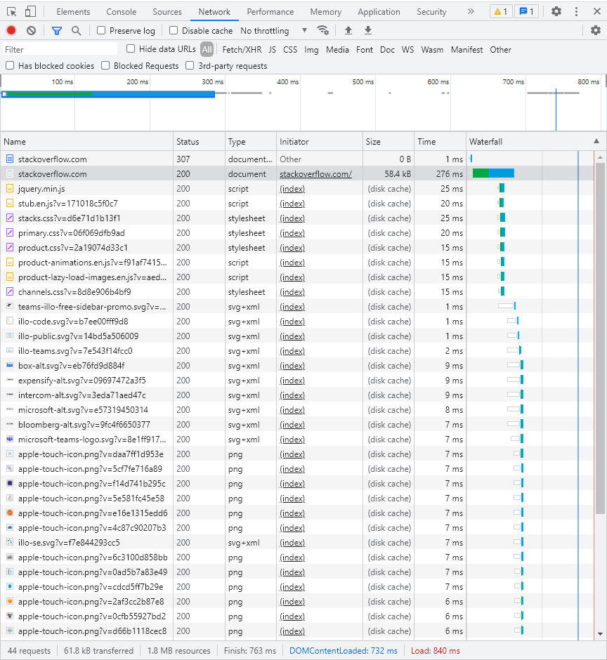

# Домашняя работа к занятию "3.6. Компьютерные сети, лекция 1"

1. Работа c HTTP через телнет.
- Подключитесь утилитой телнет к сайту stackoverflow.com
`telnet stackoverflow.com 80`
- отправьте HTTP запрос
```bash
GET /questions HTTP/1.0
HOST: stackoverflow.com
[press enter]
[press enter]
```
- В ответе укажите полученный HTTP код, что он означает?
    * `HTTP/1.1 301 Moved Permanently` - Запрашиваемый ресурс перемещен навсегда
2. Повторите задание 1 в браузере, используя консоль разработчика F12.
- откройте вкладку `Network`
- отправьте запрос http://stackoverflow.com
- найдите первый ответ HTTP сервера, откройте вкладку `Headers`
- укажите в ответе полученный HTTP код.
    * `Status Code: 307 Internal Redirect`
- проверьте время загрузки страницы, какой запрос обрабатывался дольше всего?
    * Время загрузки станицы 276ms, дольше всего обрабатывалась сама страница, а после `analitics.js`
- приложите скриншот консоли браузера в ответ.

3. Какой IP адрес у вас в интернете?
    * Статический ;)
4. Какому провайдеру принадлежит ваш IP адрес? Какой автономной системе AS? Воспользуйтесь утилитой `whois`
    * ```
      organisation:   ORG-SA582-RIPE
      org-name:       SkyNet Ltd.
      ...
      origin:         AS39087
      ```
5. Через какие сети проходит пакет, отправленный с вашего компьютера на адрес 8.8.8.8? Через какие AS? Воспользуйтесь утилитой `traceroute`
   ```
    vagrant@vagrant:~$ traceroute -An 8.8.8.8
    traceroute to 8.8.8.8 (8.8.8.8), 30 hops max, 60 byte packets
     1  192.168.50.1 [*]  0.259 ms  0.167 ms  0.214 ms
     2  * * *
     3  93.100.0.93 [AS35807]  1.121 ms  1.039 ms  1.088 ms
     4  93.100.0.139 [AS35807]  1.037 ms  1.073 ms  0.896 ms
     5  93.100.0.110 [AS35807]  1.137 ms  1.069 ms  1.148 ms
     6  185.37.128.161 [AS35807]  1.125 ms  0.978 ms  0.942 ms
     7  72.14.216.110 [AS15169]  0.968 ms  0.965 ms  0.978 ms
     8  10.252.225.62 [*]  1.034 ms 10.252.209.126 [*]  1.042 ms 10.23.205.254 [*]  1.850 ms
     9  209.85.252.220 [AS15169]  1.027 ms 74.125.244.129 [AS15169]  1.993 ms  2.000 ms
    10  74.125.244.133 [AS15169]  3.515 ms 74.125.244.132 [AS15169]  1.034 ms 74.125.244.181 [AS15169]  0.987 ms
    11  72.14.232.84 [AS15169]  1.476 ms  1.438 ms 216.239.48.163 [AS15169]  4.725 ms
    12  216.239.56.113 [AS15169]  6.459 ms 142.251.51.187 [AS15169]  4.509 ms  4.353 ms
    13  * 172.253.51.189 [AS15169]  5.498 ms 108.170.233.161 [AS15169]  4.565 ms
    14  * * *
    15  * * *
    16  * * *
    17  * * *
    18  * * *
    19  * * *
    20  * * *
    21  * * *
    22  8.8.8.8 [AS15169]  4.234 ms * *
   ```
6. Повторите задание 5 в утилите `mtr`. На каком участке наибольшая задержка - delay?
   ```
    Host                                               Loss%   Snt   Last   Avg  Best  Wrst StDev
     3. AS35807  93.100.0.93                           0.0%    37    0.6   0.8   0.6   4.9   0.7
     4. AS35807  93.100.0.139                          0.0%    37    0.7   1.0   0.7   4.6   0.8
     5. AS35807  93.100.0.110                          0.0%    37    1.0   1.5   0.7  19.9   3.1
     6. AS35807  185.37.128.161                        0.0%    37    1.2   1.1   1.0   1.6   0.1
     7. AS15169  72.14.216.110                         0.0%    37    0.8   0.9   0.8   1.7   0.2
     8. AS15169  74.125.244.129                        0.0%    37    1.9   2.2   1.7   8.8   1.1
     9. AS15169  74.125.244.132                        0.0%    37    2.8   5.3   0.9 122.9  20.1
    10. AS15169  72.14.232.85                          0.0%    37    1.7   1.7   1.2   5.4   0.9
    11. AS15169  142.251.51.187                        0.0%    37    4.4   6.1   4.2  26.6   4.6
    12. AS15169  142.250.232.179                       0.0%    37    6.1   6.4   6.0   9.3   0.5
    13. ???
    14. ???
    15. ???
    16. ???
    17. ???
    18. ???
    19. ???
    20. ???
    21. ???
    22. ???
    23. ???
    24. AS15169  8.8.8.8                               0.0%    36    4.6   4.8   4.3   9.2   1.1
   ```
    * Наибольшая задержка на участке`AS15169  74.125.244.132`
7. Какие DNS сервера отвечают за доменное имя dns.google? Какие A записи? воспользуйтесь утилитой `dig`
   * Сервера отвечающие за доменное имя dns.google:
   ```bash
    vagrant@vagrant:~$ dig dns.google NS +noall +answer
    dns.google.             3021    IN      NS      ns3.zdns.google.
    dns.google.             3021    IN      NS      ns2.zdns.google.
    dns.google.             3021    IN      NS      ns1.zdns.google.
    dns.google.             3021    IN      NS      ns4.zdns.google.
   ```
   * А записи:
    ```bash
    vagrant@vagrant:~$ dig dns.google A +noall +answer
    dns.google.             375     IN      A       8.8.8.8
    dns.google.             375     IN      A       8.8.4.4
    ```
8. Проверьте PTR записи для IP адресов из задания 7. Какое доменное имя привязано к IP? воспользуйтесь утилитой `dig`
    ```bash
    vagrant@vagrant:~$ dig -x 8.8.8.8 +short
    dns.google.
    vagrant@vagrant:~$ dig -x 8.8.4.4 +short
    dns.google.
    ```